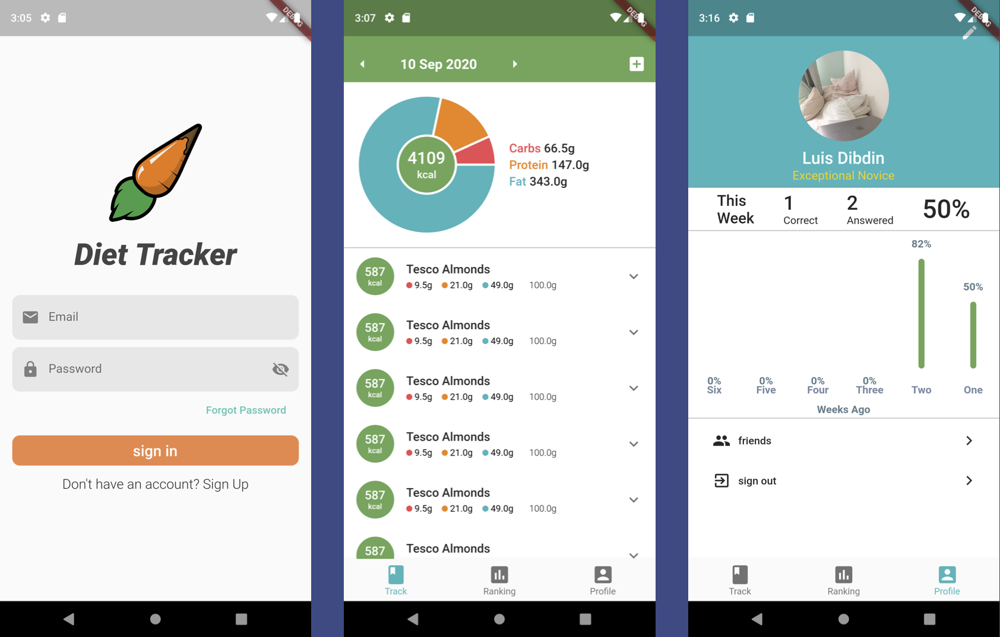

For my Masters dissertation I decided to create a diet tracker mobile app. The aim of this app was to allow users to track their diet and to use gamification to reward users if they knew how many calories, fat, protein or carbohydrates were in their food. 

## Motivation Behind the Project

The two main motivations behind this project were:

1. To try and create a tool to help tackle the current obesity epidemic.
2. To learn more about software engineering principles and grow software development skills.

As someone who really cares about their own diet, I believe that by improving diets we can eliminate many lifestyle diseases such as heart disease and diabetes. After doing research into average diets in the Western World it became clear that people were eating too much because they just did not know what was in their food. In other words: people lacked an understanding of what nutrients made up their food. 

Studies showed that most people do not pay much attention to food labels. Government schemes such as "traffic light" labels, which marked high amounts of bad nutrients and red, and low amounts in green, proved not to be very effective. Taking on board this information I decided to try and implement a gamification system in the app to help increase food nutrient awareness.

## Gamification

I deliberately chose to go down a more educational path with regards to gamification as I did not want to encourage negative eating behaviours. I did not feel it was the place of the software engineer to be implementing features that require a great deal of knowledge in a specific area. So, without the ability to consult professional nutrition experts I thought it best to not to reward the user for healthy eating. Who am I to say what that is?

I then researced gamification: how to implement it effectively and how to do it ethically. I found two key things can make gamificaiton unethical:

- The gamification system causes harm to the user, whether intended or unintended.
- If the player loses sight of the main goal of the application. If they become too fixated on getting points they forget they are trying to learn about food.

By making the gamification system reward users for getting questions correct, as opposed to eating _good_ food, the possibilty of causing harm to the user is significantly reduced. The app would also only periodically ask the user questions and questions were limited per day. This helped to not overwhelm the user and to help them maintain sight of the original goal.

The ultimate goal of an app that uses gamification is to create a positive behaviour change and then be removed from the persons life. However, this can be very difficult. Studies show that for someone using a gamified app, once the rewards stop, the behaviour also stops. This is because the motivation to change ones behaviour is purely extrinsic. The goal should be to try and develop extrinsic motivation. Scott Nicholson writes about this in his article [A RECIPE for Meaningful Gamification](http://scottnicholson.com/pubs/recipepreprint.pdf).

## Tools Used to Create the Application

I decided to use Flutter and Firebase as the front-end and back-end solutions for this project, respectively. They are both developed by Google. 

### Flutter

Flutter uses the programming language Dart. It's also cross-platform and compiles to native code. I loved working with Flutter, it made developing the front-end super easy and quick. Everything is a Widget. So to make something you combine parent and child widgets together in a massive widget tree. If you want a container box, then you'd use the Container widget, if you want to add padding to that box, then wrap it in a Padding widget.

### Firebase

The back-end was built using Firebase. This handled user authentication, the database, and the storage. I have had a decent amount of experience with SQL and using relational databases but Firebase doesn't use these. It uses NoSQL. However, it was really easy to get to grips with and quick to set up.

Firebase handling authentication and the database was really useful. It made setting up database rules really easy so that only the current authenticated user could access their documents in the database.

## The Final Product

I used the [Open Food Facts](https://world.openfoodfacts.org) API to get the data on each food item. They have an extensive open source database a long with barcodes so a barcode scanner can be used to get the information. Then there's a leaderboard to view your all time and weekly scores compared to your friends. Finally, a main profile, where you can see how are you doing this week, as well as your last 6 weeks of progress.

When the user scanned a food item, they would periodically be asked how many either how many calories, fat, protein, or carbohydrates they thought were in the food they has just eaten. If they got it right they would get a point.

To create the question, I took in the right answer as the seed, and generated a list of numbers above and below the right answer. Then, I picked three of those numbers at random and combined them with the right answer. This way, the right answer was always an option, the wrong answers were random, but still in the right ball park.

Full source code can be found at [GitHub](https://github.com/luisdibdin/foodApp).