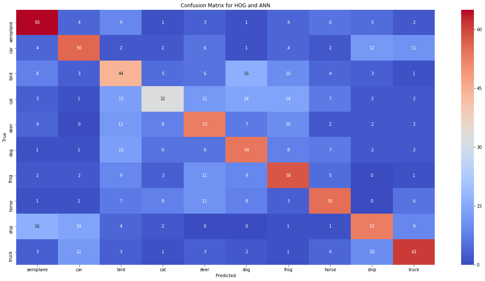
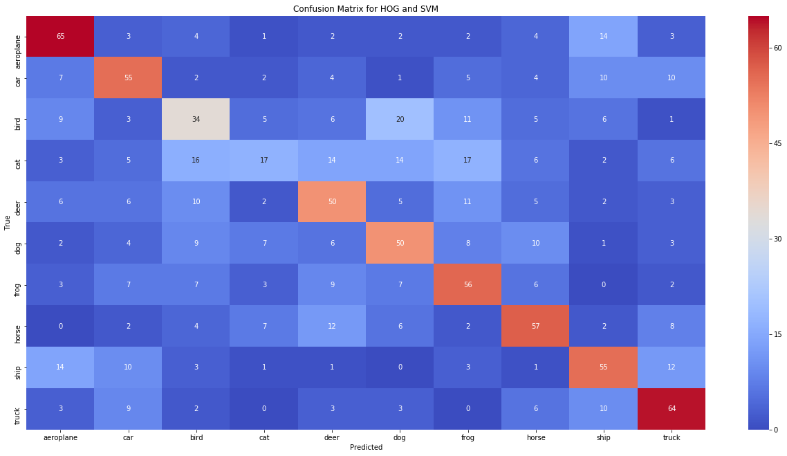
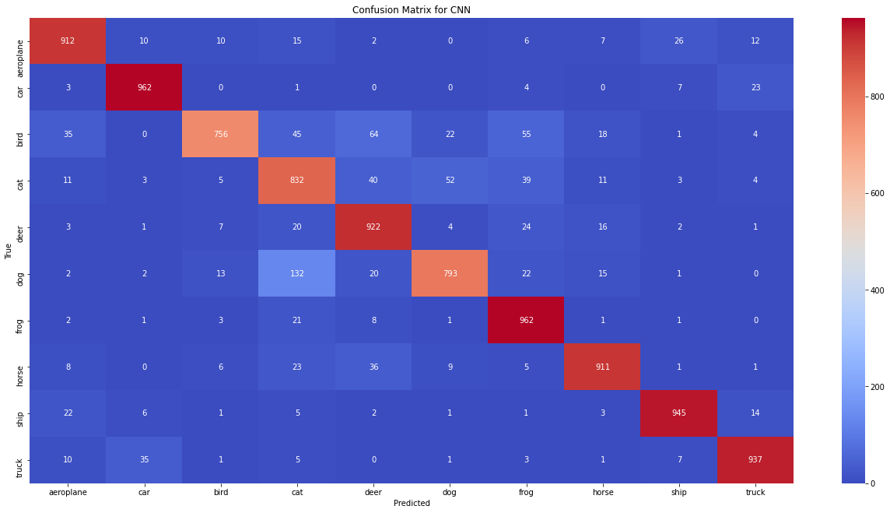

This project aimed to compare different methods of feature extraction and classification of images from the CIFAR-10 dataset. The CIFAR-10 dataset is a big dataset of 10 classes of images, including dogs, cats, trucks, deer, planes, etc...

## HOG Feature Extraction

Originally, I used the histogram of oriented gradients method to extract features. I created a very simple neural network to begin with to classify the images and achieved around 50% accuracy.

I then tried to classify the dataset using a support vector machine and again, acheived about 50% accuracy.

I also tried other methods such as PCA and SVM which achieved about 20%, a bit better than just random but a very poor classifier.

## Image Classifier Revisited

I recently revisited this project after teaching myself more about Convolutional Neural Networks. CNN's seemed like they would perform much better at solving this kind of problem.

I flattened the dataset and used six hidden layers in pairs of two. After each pair I would perform batch normalization, max pooling, and dropout to improve accuracy. Combining this with some prior image manipulation achieved a 90% accuracy, significantly higher than the classification methods I had previously tried. Below you can see a confusion matrix of the test dataset. 

