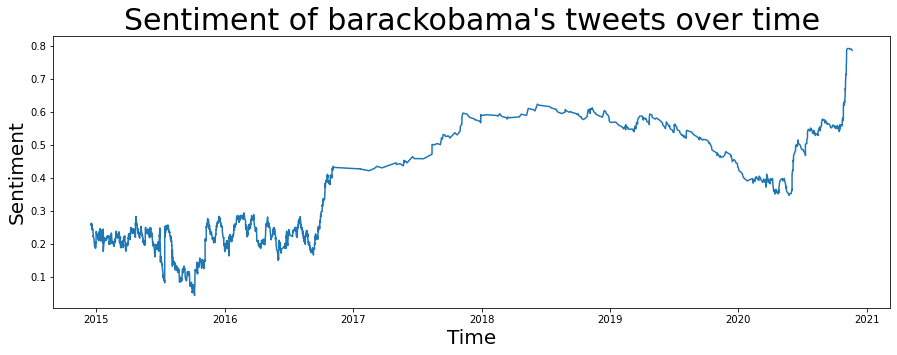

I have been really interested in learning more about natural language processing. Things like word embeddings and sentiment analysis have always sounded really interesting to me but I knew hardly anything about them, let alone how to perform them on text. I decided it was finally time to change this.

## The Plan

I tried to go about this project like a Data Scientist. Which means to go about a project in roughly the following order:

1. Ask a question.
2. Collect the data and clean it.
3. Perform some exploratory data analysis.
4. Perform machine learning techniques.
5. Review the results and insights.

My initial idea was to see if the language Donald Trump uses has changed over the course of his presidency. It would be interesting to see if a computer thought he was very positive and objective because he often appears to be objectively saying things like he won the election and he is amazing. Being a notorious tweeter and often using Twitter to say eactly what he is thinking, with no filter, scraping his tweets would be a great way to collect all the data.

## Collecting and Cleaning Data

To collect the data I used a Python library called Tweepy which uses the Twitter API to fetch tweets. You can scrape tweets with a search query or a username, and filter out retweets. Once I obtained all the data I needed to clean it. Tweets can contain a lot of unwanted data: things like mentioning other users, links, hashtags, and punctuation. I created the following function that takes a dataframe, cleans it, and returns the new dataframe.

```python
def clean_df(data):
    data = re.sub(r'@[A-Za-z0-9]+', '', data)
    data = re.sub(r'#', '', data)
    data = re.sub(r'https?:\/\/\S+', '', data)
    data = re.sub(r'\n', ' ', data)
    data = re.sub(r'[%s]' % re.escape(string.punctuation), '', data)
    data = re.sub(r'\w*\d\w*', '', data)
    data = re.sub(r'•', '', data)
    data = re.sub(r'[‘’“”…]', '', data)
    return data
```

Unfortunately I encountered a problem here that I have yet to resolve. There seems to be a problem fetching Donald Trump's tweets. If I tell Tweepy to fetch 2000 tweets then for every user this works fine, except Trump. Sometimes Tweepy returns one tweet, sometimes twelve, sometimes it makes it to 100. It's a strange bug that may be intentional as he is the president. Knowing this, I decided to switch my focus to comparing the sentiment of Obama, keeping in the theme of presidents.

## Analysing Sentiment

For analysing the sentiment I used _vader_ from a library called _nltk_. Vader analyses text and returns how negative, neutral, and positive the text is, as well as a compound figure which is the overall sentiment of the text. After getting 3000 of Obama's tweets which span all the way back to 2014, I put them all into a Pandas dataframe. I created a function to then analyse the sentiment of a sentence then return the compound value. By applying this function to every tweet in the dataframe I added a column which contained the sentiment of each tweet.

Using this I could then plot a time series graph showing the change in Obama's sentiment over time. After applying an exponential moving average algorithm to the data to reduce all the noise, the following graph was produced:



I thought this was interesting because it clearly shows at the end of 2016 his sentiment shot up. And then very recently it went up again. This coincides with him leaving office and Joe Biden winning the election respectively.

## Further Analysis

Finding that there seems to be two different Obama's tweeting: the more neutral President Obama, and the more positive Post-President Obama, I thought it would be interesting to see how his language changed over time. I split the dataset into two parts, pre October 2016, and Post October 2016. Then by tokenizing all the tweets and removing stop words, I created a Document-Term Matrix for both parts of the dataset. Then by describing the dataset, transposing the description, and sorting by max, I obtained his top 15 most used words. And found... not a lot. 

Obama's vocabulary is very broad and his most used words were only used three times in both datasets. Unfortunately this doesn't really tell me a lot. My next step will be to look into topic modelling, using LDA (Latent Dirichlet Allocation), both parts of the dataset to get a more general sense of whether the topics Obama talked about has changed. This could potentially provide more fruitful insights.